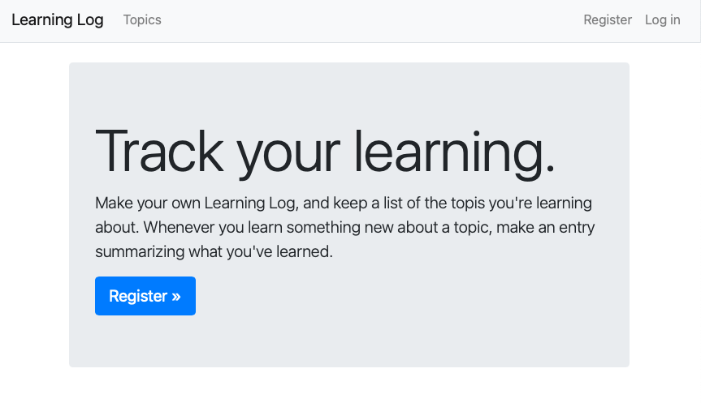

# Learning Tracker

This was my first time testing out the [django framework](https://www.djangoproject.com) by Python. To go hands-on with the frawework, I did a step-by-step tutorial based on the book [Python Crash Course](https://ehmatthes.github.io/pcc_2e/regular_index/). 

Overall the experience was good, I learned a lot about what it takes to build a django app from scratch, which essentially is a CRUD app that creates, reads, updates and delete. 

## How Django Works

#### Web Requests ->  URLs -> View Functions -> Templates

After completing the tutorial, I found the way django works is boiled down to the above steps.

* Django can be defined as a set of components that receives web requests and returning them. In other words, django can accept the request for URLs like www.x.com, and return the HTML needed for the browser to render the page.
* The entry point for the django app are URls. As a django developer, there is complete freedom to define URLs to be whatever they want. And this URL is what allows a user to access the app, which is then passed to a view function for processing.
* View functions are python code that are executed when the URL is accessed, this function can simply be returning a string of text, or it can be as complex as processing payments, querying databases, processing forms, etc. Once this view is done processing, a web response (HTML template) is provided back to the user.
* This web response basically tells the user that they are in the right webpage, and they are created with Django's templating system.

These are the core concepts that gives a developer flexibility and freedom to build a wide range of applciations, either a simple blog, or a learning tracker in my case, to rich desktop applications. To give an example, Pinterest and Instagram are powered by the Django Framework.

## What I've learned 

### Creating a django apps
* setting up a virtual env with pyenv
* Creating superuser for admin sites
* Using Django shell to work with project's data in terminal session
* Define URLs, create view functions and write templates
* Used template inheritance to simplify structure for individual templates

### Setting up user accounts
* Used forms to users to add entries
* added log in and out functionality
* Used django's UserCreationForm to let people create accounts
* Used decorator function `@login_required` to restrict access to certain pagse

### Styling and deploying
* Used the bootstrap library and django-bootstrap4 app to give my web app a professional appearance
* Used boostrap templates and using the Navbar static template 
* Used a jumbotron to style my home page
* Deployed to heroku 
* Secured my app by setting `DEBUG=False` on the live server

I'm by no means a django expert, thus I will continue to develop this app as I learn more about this framework and expand my web-dev abilities

---

## Resources for Django
* [django doc](https://docs.djangoproject.com/en/3.1/intro/tutorial01/)
* [advanced django doc](https://docs.djangoproject.com/en/3.1/intro/reusable-apps/)
* [Full Stack Python Django](https://www.fullstackpython.com/django.html)
* [PCC django resources](https://ehmatthes.github.io/pcc_2e/recommended_reading/django/)
* [Hackernoon Django resources](https://hackernoon.com/my-top-5-django-resources-8yk2gwe)
